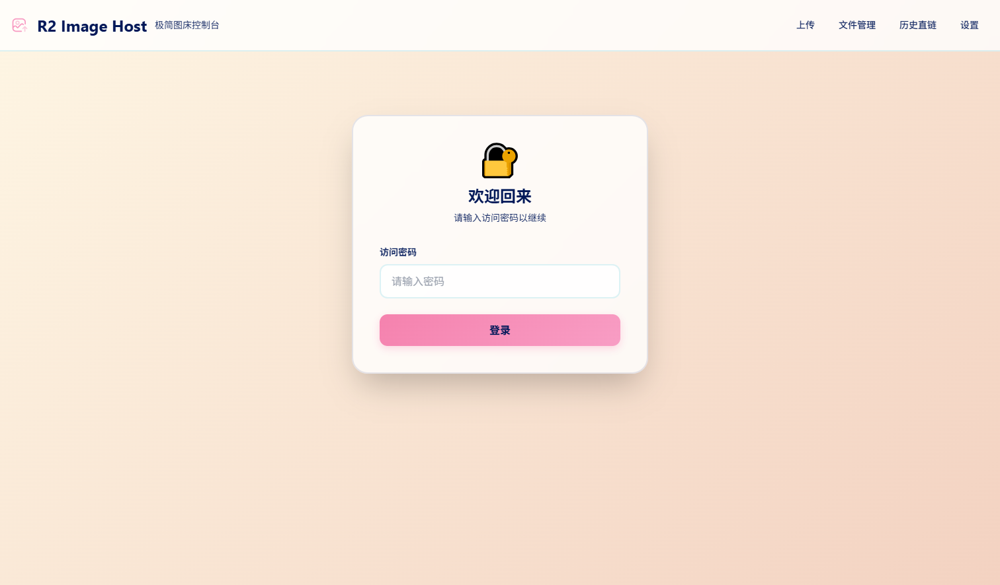
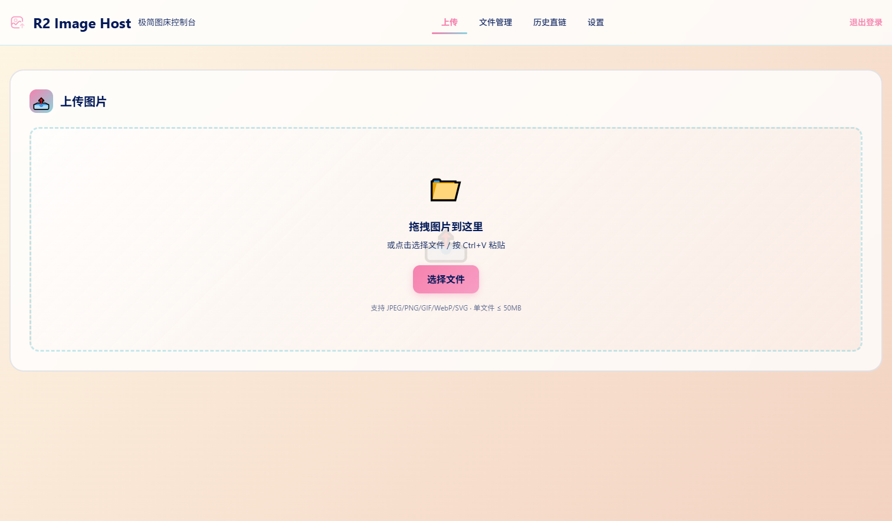
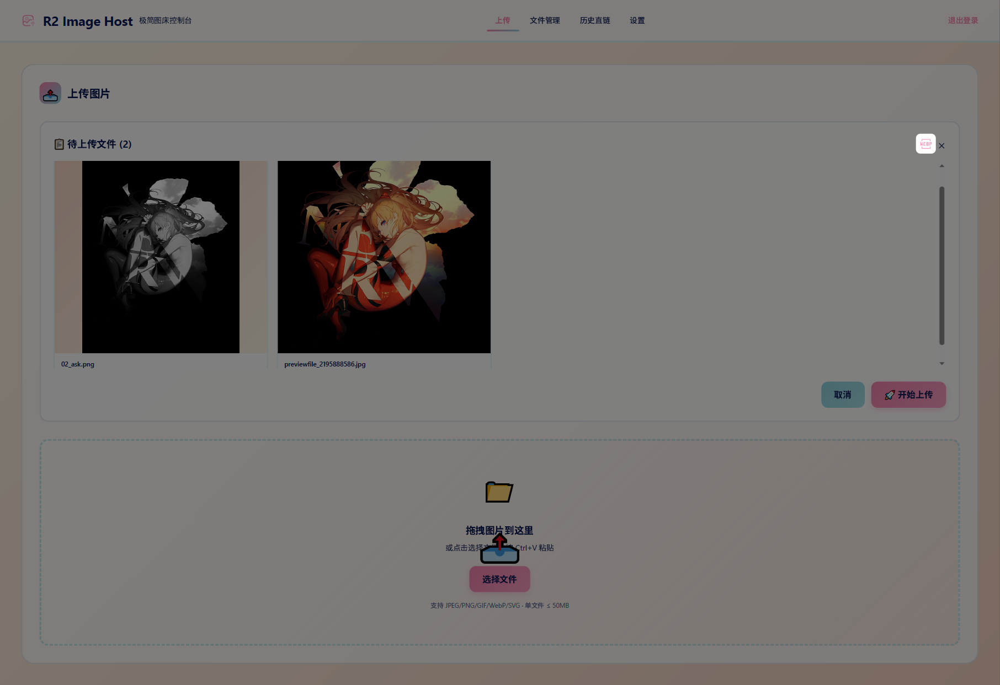
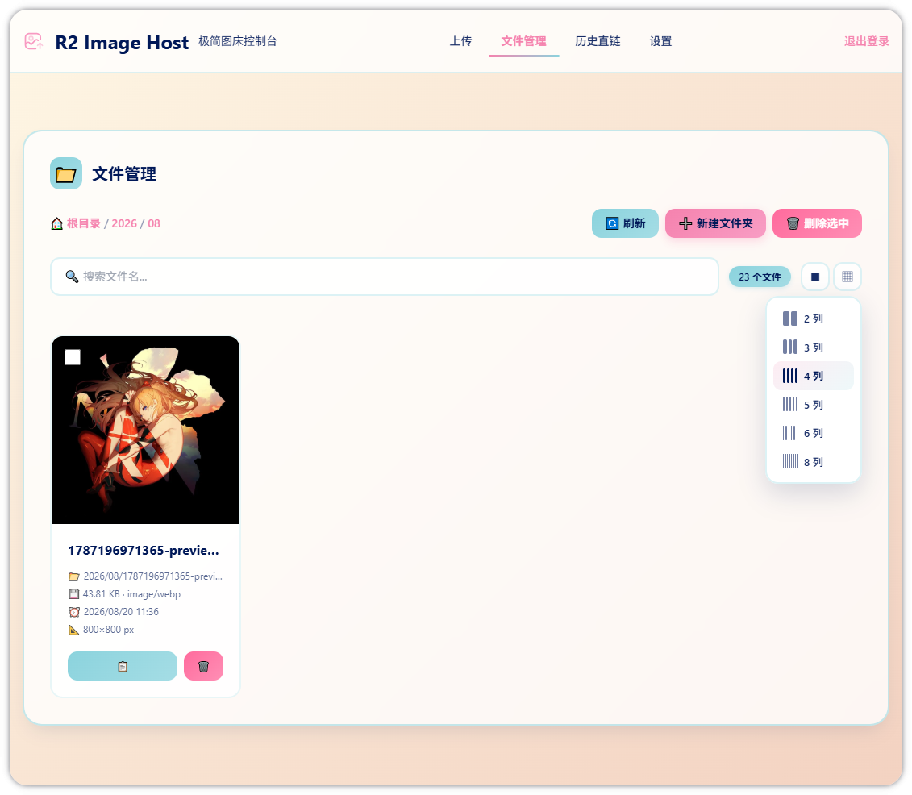
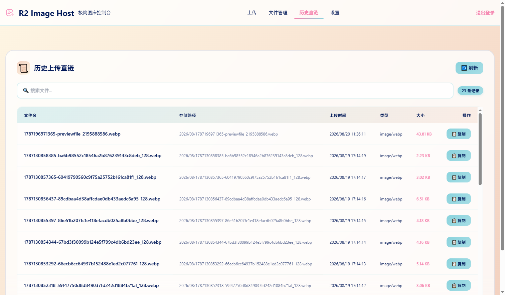

# Cloudflare R2 Image Host

基于 Cloudflare Workers、R2 和 KV 的极简单用户图床系统，实现认证、图片上传、文件管理、文件夹维护与统计功能，配套 TailwindCSS 单页控制台。

## 功能

- 单密码登录，KV 存储 session
- 图片上传（JPEG/PNG/GIF/WebP/SVG）、类型/大小校验
- R2 对象自动按日期或自定义路径命名与缓存配置
- 文件列表、搜索、批量删除、文件夹 CRUD
- 控制台展示统计信息
- 可选公共域名直链输出
- 🆕 WebP 格式转换（客户端 Canvas API，可选开启）
- 🆕 图片尺寸显示（宽高自动读取）
- 🆕 文件列表倒序排列（最新上传在最前）
- 🆕 每行显示列数可选（2-6列，localStorage 持久化）
- 🆕 全选 / 取消全选 / 反向选择

## 页面展示







## 本地开发

1. 安装依赖

```bash
npm install
```

2. 登录 Cloudflare

```bash
npx wrangler login
```

3. 创建 R2 存储桶与 KV 命名空间（记录 ID 并填入 `wrangler.toml`）

```bash
npx wrangler r2 bucket create <your-bucket-name>
npx wrangler kv:namespace create "KV"
```

4. 设置 Worker 密码

```bash
npx wrangler secret put APP_PASSWORD
```

5. 运行开发模式

```bash
npm run dev
```

6. 部署

```bash
npm run deploy
```

或使用一键部署脚本（需要 PowerShell）：

```powershell
.\deploy.ps1              # 部署 Worker + 更新 Secret
.\deploy.ps1 -SkipSecret  # 仅部署，跳过 Secret 设置
.\deploy.ps1 -PushGit     # 部署 + 自动提交推送到 GitHub
```

## 环境变量

在 `.env` 文件中配置：

```env
app_secret=<你的登录密码>
cloudflare_api_token=<你的Cloudflare API Token>
```

- `APP_PASSWORD`：登录密码（通过 `wrangler secret` 管理）
- `R2_PUBLIC_DOMAIN`：R2 公共访问域名（`wrangler.toml` 中配置，例如 `https://img.example.com`）

## 部署到 Cloudflare

1. 在 Cloudflare 控制台创建 R2 存储桶（名称：`image-r2`）和 KV 命名空间
2. 为 R2 桶配置自定义域名（用于公开访问图片）
3. 将 KV ID 和 R2 桶名填入 `wrangler.toml`
4. 配置 `.env` 文件
5. 运行 `.\deploy.ps1`

## 安全建议

- 生产环境使用密码哈希或更安全的认证方式
- 配置 Cloudflare 防火墙、Turnstile 或 IP 限制
- 限制 CORS 允许的域名
- 根据需求调整速率限制参数

## 许可证

MIT
